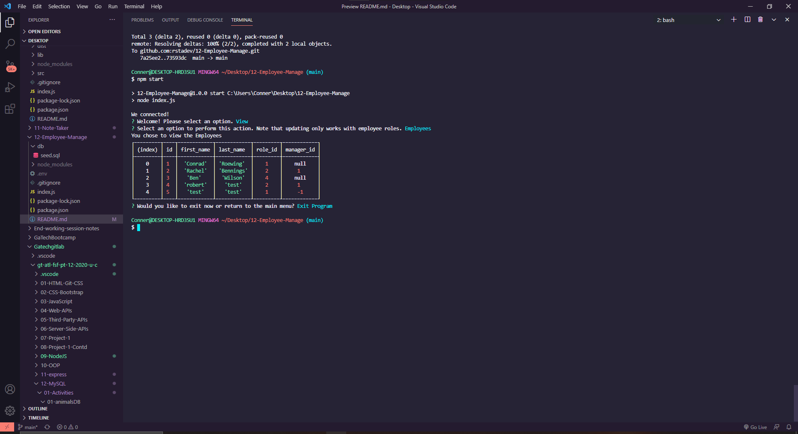

  # Employee Management System

  

    

  <!-- Titled description for grading clarity. Will remove after grading -->
  ## Description
  This project was assigned during the Georgia Tech Full Stack Flex Development Program. The aim of this project was to utilize node to create a system capable of managing several employees, departments, and individual roles. I believe I have accomplished this, though with a few bugs I hope to get rid of within the coming weeks.
   

  )

  A demo video can be downloaded here: https://github.com/rstadev/12-Employee-Manage/blob/main/assets/demoems.mp4

  
  ## Table of Contents
  1. [Description](#description)
  2. [Installation](#installation)
  3. [Usage](#usage)
  4. [License](#license)
  5. [Contributing](#contributing)
  6. [ContactMe](#contactme)
  

  ## Installation
  Download the zip file for the github repo. From here, type npm i into git bash while located in the main file branch of the downloaded app. From this point the program should be downloaded fully and ready to use. Type npm start to begin the app.
   

  ## Usage
  To use this program, simply follow the prompts after typing npm start.
   

  ## License
  Link at: https://opensource.org/licenses/MIT
   
  License information: Copyright 2021 

    Permission is hereby granted, free of charge, to any person obtaining a copy of this software and associated documentation files (the "Software"), to deal in the Software without restriction, including without limitation the rights to use, copy, modify, merge, publish, distribute, sublicense, and/or sell copies of the Software, and to permit persons to whom the Software is furnished to do so, subject to the following conditions:
    
    The above copyright notice and this permission notice shall be included in all copies or substantial portions of the Software.
    
    THE SOFTWARE IS PROVIDED "AS IS", WITHOUT WARRANTY OF ANY KIND, EXPRESS OR IMPLIED, INCLUDING BUT NOT LIMITED TO THE WARRANTIES OF MERCHANTABILITY, FITNESS FOR A PARTICULAR PURPOSE AND NONINFRINGEMENT. IN NO EVENT SHALL THE AUTHORS OR COPYRIGHT HOLDERS BE LIABLE FOR ANY CLAIM, DAMAGES OR OTHER LIABILITY, WHETHER IN AN ACTION OF CONTRACT, TORT OR OTHERWISE, ARISING FROM, OUT OF OR IN CONNECTION WITH THE SOFTWARE OR THE USE OR OTHER DEALINGS IN THE SOFTWARE.
    
    

   

  ## Contributing

  To contribute, contact me via my github.
   

  ## ContactMe
  Message me on Github at https://github.com/rstadev
   
  or email me at
   
   

